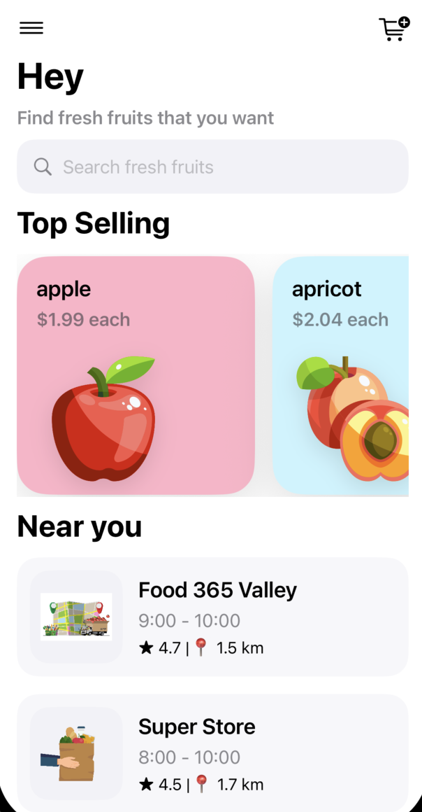
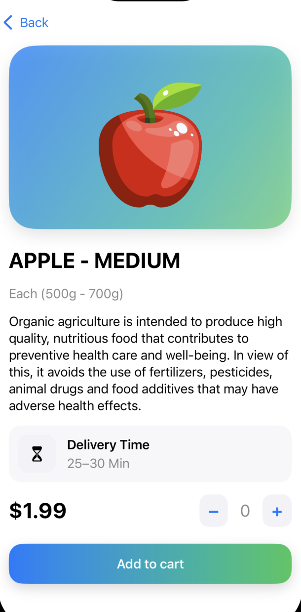
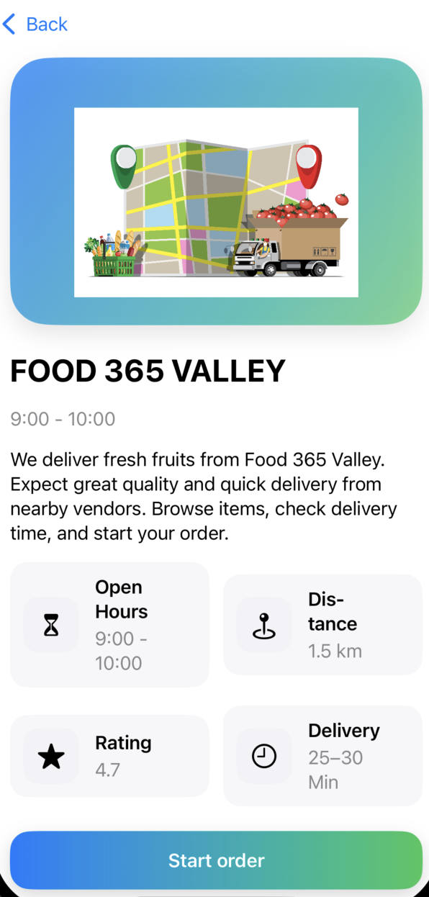

# 🍎 FruitShopApp

A simple **SwiftUI shopping app** for browsing and ordering fresh fruits.
Built as part of a learning project to practice **SwiftUI layouts, navigation, and data modeling**.

---

## 📱 Features

* **Onboarding splash screen**
* **Home screen** with:

  * Top menu + cart icon
  * Search bar
  * **Top Selling Fruits** section (scrollable horizontally)
  * **Nearby Stores** section (list view)
* **Fruit Detail Page**:

  * Big product image
  * Price, description, delivery time
  * Add-to-cart with quantity stepper
* **Store Detail Page**:

  * Store image + info (hours, rating, distance)
  * Start order button

---

## 🖼 Screenshots

| Home Screen              | Fruit Detail               | Store Detail               |
| ------------------------ | -------------------------- | -------------------------- |
|  |  |  |

---

## 🛠 Tech Stack

* **SwiftUI** (UI + navigation)
* **MVVM-inspired structure**

  * `Model/` → Fruit + Store data models
  * `HomeScreenViews/` → UI components (cards, lists, detail views)
* **Assets.xcassets** for fruit & store images, color sets

---

## 📂 Project Structure

```
FruitShopApp/
│
├── FruitShopApp.swift         # App entry point
├── OnBoardingScreen.swift     # Splash screen
├── ContentView.swift          # Home wrapper
│
├── Model/
│   ├── Fruit.swift            # Fruit model + data
│   └── Places.swift           # Store model + data
│
├── HomeScreenViews/
│   ├── HomeScreenView.swift   # Main home
│   ├── TopSellingView.swift   # Fruits horizontal scroll
│   ├── FruitCard.swift        # Fruit card component
│   ├── FruitDetailView.swift  # Fruit detail page
│   ├── NearYouView.swift      # Stores list
│   ├── StoreRowView.swift     # Store row component
│   └── NearYouDetailView.swift# Store detail page
│
└── Assets.xcassets/           # Fruits, stores, color sets
```

---

## 🚀 Getting Started

1. Clone the repo:

   ```bash
   git clone https://github.com/negarprh/FruitShopApp.git
   ```
2. Open `FruitShopApp.xcodeproj` (or `FruitShopApp.xcworkspace`) in **Xcode**.
3. Run on **iOS Simulator** (tested on iOS 17/18).

---

## 🎯 Learning Goals

* Practice **SwiftUI layout** (Stacks, ScrollView, NavigationStack).
* Learn to structure projects with **separate views + models**.
* Explore asset management for **images + color sets**.
* Understand **navigation + detail pages** in SwiftUI.

---

## 📌 Next Steps / Improvements

* Add a real cart system (persist selected items).
* Connect to API for dynamic fruit & store data.
* Add user login & profile.
* Polish UI with animations (e.g., smooth transitions).

---
